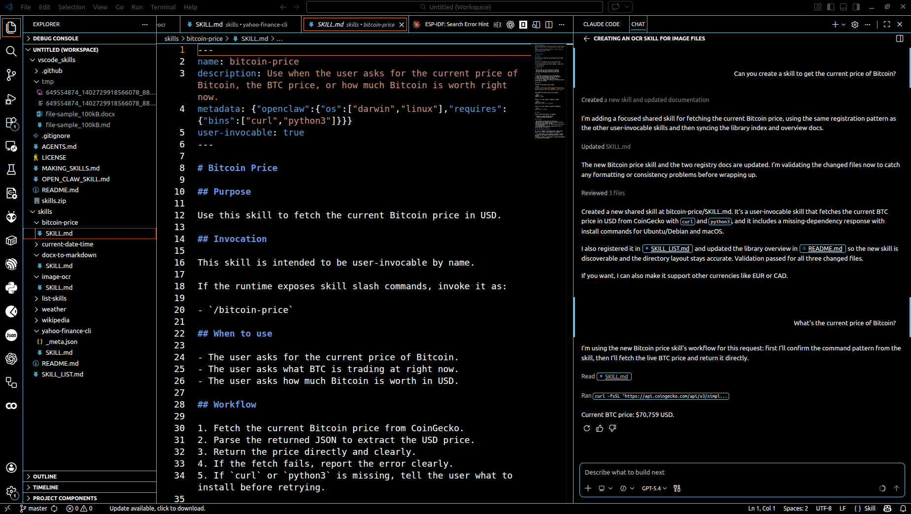

# Visual Studio Code Skills



This repository is a small workspace for experimenting with reusable agent skills, documenting how those skills are structured, and wiring them into a prompt-driven workflow.

The `vscode_skills` repository now contains both the repo-specific control files and the shared skills library.

The main repo content lives under `${HOME}/work/vscode_skills`, and the shared skill library now lives inside that repo at `${HOME}/work/vscode_skills/skills`.

For compatibility with older prompts and tooling, `${HOME}/skills` is a symlink that points to `${HOME}/work/vscode_skills/skills`.

## What This Project Does

This project gives you a place to:

- define reusable skills as folders with `SKILL.md` files
- keep a human-maintained skill index in `SKILL_LIST.md`
- route tasks through a prompt that tells the agent to choose and read a skill first
- experiment with OpenClaw-style skill authoring and invocation patterns
- add prompt-driven skill eval cases and grading helpers for Copilot-in-the-loop testing

In short, this repo now contains both the control layer and the content layer, with the shared skills stored in the in-repo `skills/` directory.

This repo can also hold skill-eval scaffolding that grades captured assistant outputs against case assertions when you want to test prompt-driven skill behavior.

## How It Works

There are four main pieces.

### 1. Repo instructions

This repo includes:

- `AGENTS.md`
- `.github/copilot-instructions.md`

These files tell the coding agent how to behave in this repository. They establish rules like:

- read relevant instructions before changing files
- consult the shared skills library when a task matches a reusable skill
- prefer small, explicit, low-risk changes

### 2. Prompt-driven skill selection

This repo includes a prompt file:

- `.github/prompts/use-a-skill.prompt.md`

Its job is simple: tell the agent to read the shared skill index, pick the closest matching skill, open that skill's `SKILL.md`, and follow it.

That means the prompt does not contain the skill logic itself. It delegates to the shared skill library.

### 3. Shared skill library

The real skills live in:

- `${HOME}/work/vscode_skills/skills`

That folder contains:

- `SKILL_LIST.md`: the index of officially available skills
- one folder per skill
- a `SKILL.md` inside each skill folder

For compatibility, `${HOME}/skills` points to the same directory via symlink.

Examples currently in the shared library include:

- `arxiv-search`
- `bitcoin-price`
- `current-date-time`
- `docx-to-markdown`
- `excel-to-delimited`
- `excel-to-markdown`
- `hacker-news-top10`
- `image-ocr`
- `company-research`
- `news-search`
- `stock-investment-review`
- `stock-research`
- `stock-review-market-context`
- `stock-review-output-contract`
- `stock-review-supporting-research`
- `weather`
- `wikipedia`
- `yahoo-finance`
- `yahoo-finance-cli`

The important rule is that `SKILL_LIST.md` is the source of truth. A skill folder existing on disk is not enough by itself. If it is not listed in the index, it should not be treated as officially available.

### 4. Eval and test scaffolding

This repo can also hold prompt-driven skill eval scaffolding for VS Code and Copilot workflows.

That currently includes:

- `evals/cases/`: case files with prompts and assertion rules
- `evals/runner/skill_eval.py`: a small runner that grades captured assistant output
- `tests/test_skill_eval_runner.py`: unit tests for the runner itself

These evals are intentionally Copilot-in-the-loop. They grade captured output rather than launching GitHub Copilot automatically from a local CLI.

## Project Structure

Current repo structure:

```text
vscode_skills/
	.github/
		copilot-instructions.md
		prompts/
			use-a-skill.prompt.md
	AGENTS.md
	evals/
		cases/
			arxiv-search/
				arxiv-search-topic-success.json
		runner/
			skill_eval.py
	OPEN_CLAW_SKILL.md
	README.md
	skills/
		SKILL_LIST.md
		arxiv-search/
		company-research/
		excel-to-delimited/
		excel-to-markdown/
		news-search/
		stock-investment-review/
		stock-research/
		yahoo-finance/
	tests/
		test_skill_eval_runner.py
```

Current shared skills structure:

```text
${HOME}/work/vscode_skills/skills/
	README.md
	SKILL_LIST.md
	arxiv-search/
		SKILL.md
		arxiv_search.py
		test_arxiv_search.py
	bitcoin-price/
		SKILL.md
	current-date-time/
		SKILL.md
	docx-to-markdown/
		SKILL.md
	excel-to-delimited/
		SKILL.md
		excel_to_delimited.py
		test_excel_to_delimited.py
	excel-to-markdown/
		SKILL.md
		excel_to_markdown.py
		test_excel_to_markdown.py
	hacker-news-top10/
		SKILL.md
	image-ocr/
		SKILL.md
	company-research/
		SKILL.md
		company_research.py
		test_company_research.py
	list-skills/
		SKILL.md
	news-search/
		SKILL.md
		news_search.py
		test_news_search.py
	stock-investment-review/
		SKILL.md
		stock_investment_review.py
		test_stock_investment_review.py
	stock-research/
		SKILL.md
		stock_research.py
		test_stock_research.py
	stock-review-market-context/
		SKILL.md
	stock-review-output-contract/
		SKILL.md
	stock-review-supporting-research/
		SKILL.md
	weather/
		SKILL.md
	wikipedia/
		SKILL.md
	yahoo-finance/
		SKILL.md
		yahoo_finance.py
		test_yahoo_finance.py
	yahoo-finance-cli/
		SKILL.md
		_meta.json
```

Compatibility symlink:

```text
${HOME}/skills -> ${HOME}/work/vscode_skills/skills
```

## Setup

### Prerequisites

You need:

- VS Code
- GitHub Copilot Chat or another compatible coding-agent workflow in VS Code
- the `vscode_skills` repo available locally

Optional but useful, depending on which skills you want to use:

- `jq`
- `curl`
- `date`
- `python3`
- `pandoc`
- `tesseract`
- `yfinance`
- Yahoo Finance CLI support through `yahoo-finance2`

### Workspace setup

Open `${HOME}/work/vscode_skills` in VS Code.

If you want to keep the older two-folder workspace layout, you can still add `${HOME}/skills`, but it now resolves to the repo-local `skills/` directory through a symlink.

This matters because:

- the repo contains the instructions and prompt files
- the repo-local `skills/` folder contains the reusable skill definitions

### Skill library setup

The shared library should contain:

1. `SKILL_LIST.md`
2. one directory per skill
3. a `SKILL.md` inside each skill directory

The canonical location is now `${HOME}/work/vscode_skills/skills`.

If you move the skills directory somewhere else again, update any references and prompts that assume the current workspace layout, or recreate the `${HOME}/skills` symlink to point at the new location.

### Tool setup for current example skills

For the skills currently in the shared library:

- `arxiv-search` needs `python3`
- `bitcoin-price` needs `curl` and `python3`
- `current-date-time` needs the system `date` command
- `docx-to-markdown` needs `pandoc`
- `excel-to-delimited` needs `python3` plus the `openpyxl` and `xlrd` Python packages
- `excel-to-markdown` needs `python3` plus the `openpyxl` and `xlrd` Python packages
- `hacker-news-top10` needs `curl` and `python3`
- `image-ocr` needs `tesseract`
- `company-research` needs `python3`
- `news-search` needs `python3`
- `stock-investment-review` needs `python3` and the `yfinance` Python package
- `stock-research` needs `python3` and the `yfinance` Python package
- `stock-review-market-context` relies on the standalone `stock-research` and `yahoo-finance` shared helpers
- `stock-review-output-contract` is a structural companion skill and has no extra runtime dependency beyond Markdown file creation
- `stock-review-supporting-research` relies on the standalone `company-research` and `news-search` shared helpers
- `weather` needs `curl`
- `wikipedia` needs `curl` and `python3`
- `yahoo-finance` needs `python3` and the `yfinance` Python package
- `yahoo-finance-cli` needs `jq` and Yahoo Finance CLI support

Example install that has already been used in this workspace:

```bash
npm install yahoo-finance2
```

Depending on how you want to expose it, you may also need a `yf` executable or wrapper.

For the Excel conversion skills, install the workbook readers with:

```bash
python3 -m pip install openpyxl xlrd
```

## Day-To-Day Workflow

Typical usage looks like this:

1. Ask the agent to use a skill-oriented prompt or give it a task that matches a known skill.
2. The agent reads `SKILL_LIST.md`.
3. The agent chooses the closest matching skill.
4. The agent reads that skill's `SKILL.md`.
5. The agent follows that workflow to answer the request or perform the action.

For OpenClaw-style skills, the `SKILL.md` can also include frontmatter such as:

- `name`
- `description`
- `metadata`
- `user-invocable`

That allows skills like `/current-date-time` or `/weather Oakland` to behave more like named commands.

Current examples of slash-style skills in this library include:

- `/arxiv-search transformer attention`
- `/bitcoin-price`
- `/company-research PostHog | site:https://posthog.com | limit:2`
- `/current-date-time`
- `/excel-to-delimited /tmp/vendor-pricing.xls | format:tsv`
- `/excel-to-markdown /path/to/research-notes.xlsx`
- `/hacker-news-top10`
- `/news-search OpenAI | time:week | limit:3`
- `/stock-investment-review WING | horizon:45d | company:Wingstop | site:https://www.wingstop.com`
- `/stock-research AAPL | period:1y | news:month`
- `/weather Oakland`
- `/wikipedia Ada Lovelace`
- `/docx-to-markdown report.docx`
- `/yahoo-finance AAPL | period:1y`

## Adding A New Skill

To add a new shared skill:

1. Create a new folder under `${HOME}/work/vscode_skills/skills`.
2. Add a `SKILL.md` file.
3. Write the skill instructions.
4. Register the skill in `${HOME}/work/vscode_skills/skills/SKILL_LIST.md`.
5. Update `${HOME}/work/vscode_skills/skills/README.md` if the library overview changed.

For simple markdown-only skills, a plain instructional `SKILL.md` is enough.

For OpenClaw-style skills, use a folder-based `SKILL.md` with YAML frontmatter and keep the frontmatter conservative.

If a shared skill includes helper code, keep that code in the skill folder and test it there. For example, the shared `arxiv-search` skill includes `arxiv_search.py` and `test_arxiv_search.py` inside `${HOME}/work/vscode_skills/skills/arxiv-search/`, and the stock-review ecosystem now exposes standalone helper skills such as `${HOME}/work/vscode_skills/skills/stock-research/`, `${HOME}/work/vscode_skills/skills/company-research/`, `${HOME}/work/vscode_skills/skills/news-search/`, and `${HOME}/work/vscode_skills/skills/yahoo-finance/` rather than concentrating those helpers only inside `${HOME}/work/vscode_skills/skills/stock-investment-review/`.

## Eval And Test Workflow

This repo now supports two complementary validation paths.

### 1. Repo-local Python validation

The repo-local Python files currently live under:

- `evals/runner/skill_eval.py`
- `tests/test_skill_eval_runner.py`

Typical validation commands:

```bash
cd ${HOME}/work/vscode_skills
ruff check evals/runner/skill_eval.py tests/test_skill_eval_runner.py
mypy evals/runner/skill_eval.py tests/test_skill_eval_runner.py
python3 -m pytest
```

### 2. Shared skill helper validation

Shared skills that ship helper code can be validated in their own folders.

Example for `arxiv-search`:

```bash
cd ${HOME}/work/vscode_skills/skills/arxiv-search
ruff check arxiv_search.py test_arxiv_search.py
mypy arxiv_search.py test_arxiv_search.py
python3 -m pytest
```

### 3. Prompt-driven skill evals

The eval runner in `evals/runner/skill_eval.py` grades captured assistant output against case assertions.

Example:

```bash
cd ${HOME}/work/vscode_skills
python3 evals/runner/skill_eval.py \
	--case evals/cases/arxiv-search/arxiv-search-topic-success.json \
	--output-file /tmp/arxiv-output.txt
```

This is useful for checking whether Copilot followed the intended skill behavior. It is not a fully automated local Copilot launcher; the model output still needs to be captured first.

## OpenClaw Notes

This repo also contains:

- `OPEN_CLAW_SKILL.md`

That file documents what was learned about OpenClaw skill syntax and authoring. It is a reference for creating future OpenClaw-compatible skills.

The main points are:

- OpenClaw skills are folder-based
- `SKILL.md` is the main file
- frontmatter should stay simple
- `metadata` should be kept as a single-line JSON object
- skill content below the frontmatter is normal markdown instructions

See the shared skill index for the current active set of skills:

- `${HOME}/work/vscode_skills/skills/SKILL_LIST.md`

## Current Purpose Of The Repo

At the moment, this project is best understood as a sandbox for:

- building a reusable shared skills library
- testing prompt-based skill selection
- testing captured-output skill evals for Copilot workflows
- experimenting with OpenClaw-compatible skills
- documenting the conventions so future skills stay consistent

## Quick Start

If you want the shortest setup path:

1. Open `${HOME}/work/vscode_skills` in VS Code.
2. If older tooling expects `${HOME}/skills`, keep the symlink pointing at `${HOME}/work/vscode_skills/skills`.
3. Make sure the basic tools you need are installed, such as `curl`, `date`, and any skill-specific CLIs.
4. Keep `${HOME}/work/vscode_skills/skills/SKILL_LIST.md` in sync with the actual skills you want available.
5. Use the prompt in `.github/prompts/use-a-skill.prompt.md` when you want the agent to route through the skills library.
6. Add new skills as folders with `SKILL.md`, then register them in the shared index.
7. When a skill includes helper code or prompt-driven evaluation behavior, add tests or eval cases alongside it.
